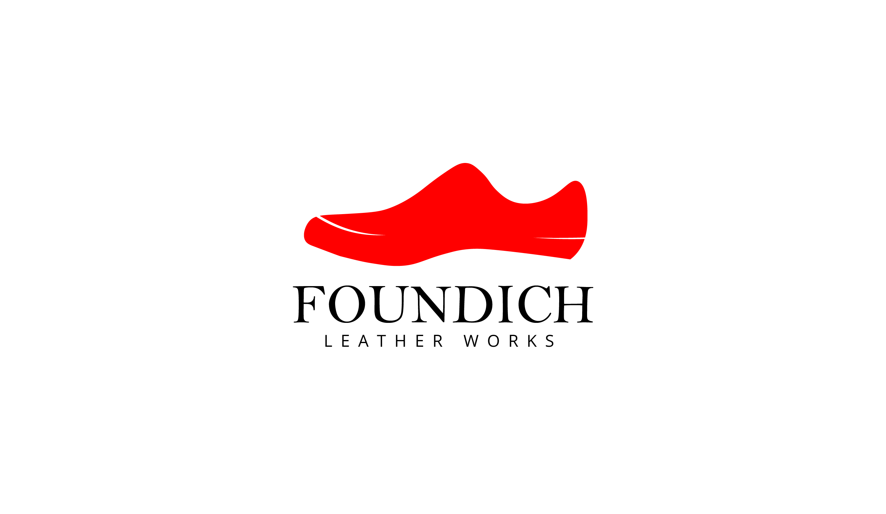

# 🥿 Foundich Leather Works

Welcome to **Foundich Leather Works** – a premium e-commerce platform for stylish, handcrafted leather footwear. This project offers a modern and seamless shopping experience built with powerful web technologies.

## 🔗 Live Demo

[Visit Foundich Website](https://foundichleatherworks.vercel.app)

## 🖼 Project Preview

## 🛠️ Tech Stack

* **Frontend**: Next.js, TypeScript, Tailwind CSS
* **Backend**: Node.js, Express (Optional for API routes if not using Firebase Functions)
* **Authentication & Database**: Wix.com , 
* **Payments**: Paystack Integration
* **Storage**: Wix store (for product images)
* **Email Notifications**: Nodemailer / wix Functions
* **Order Management**: Google Sheets API / Wix store

## 🚀 Features

* 🧾 User registration & login
* 🛍 Product listing with images, prices, and descriptions
* 🔍 Product filtering and search
* 🛒 Shopping cart with quantity control
* 📦 Checkout flow with delivery form
* 💳 Secure payment integration via Paystack
* 📬 Order confirmation with email & database storage
* 📊 Admin dashboard to manage products and deals
* 🌐 Responsive design for all devices

